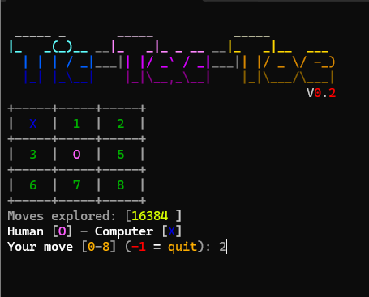
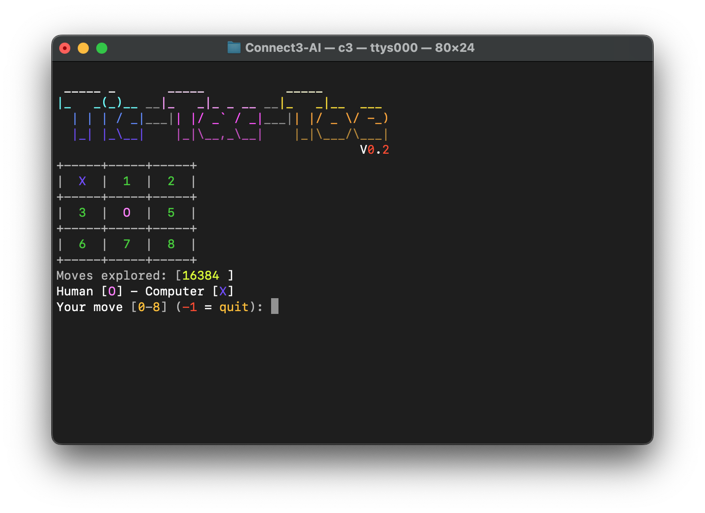

## Connect3 - AI
A simple Tic-Tac-Toe game between Human and Computer. Simply an illustration of the MiniMax algorithm. It's just for fun during the pandemic.

## Compiling
* GCC: type 'make'
* MinGW: type 'mingw32-make'

## Tested
- Clang (macOS Monterey)
- MinGW (Windows)

## Notes
- DOS support is now temporarily removed.
- Linux is not tested, I hope it would work :)

## Screenshot

