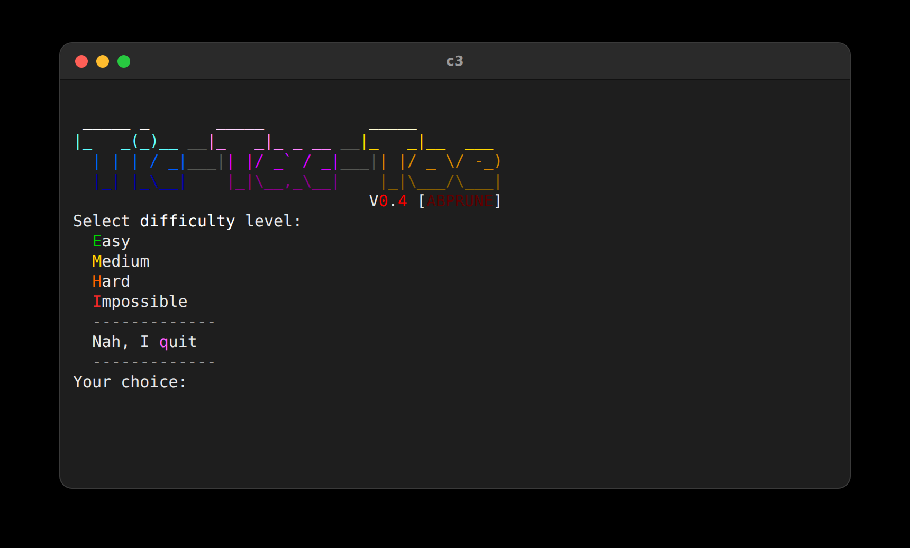
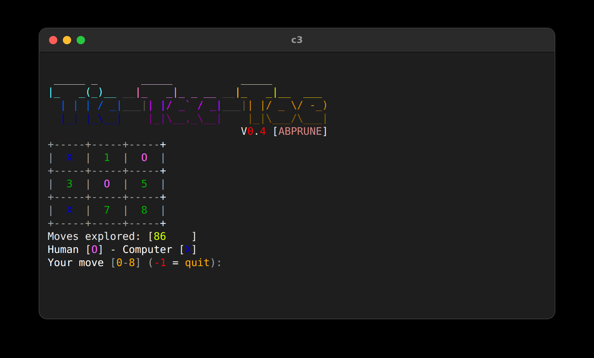
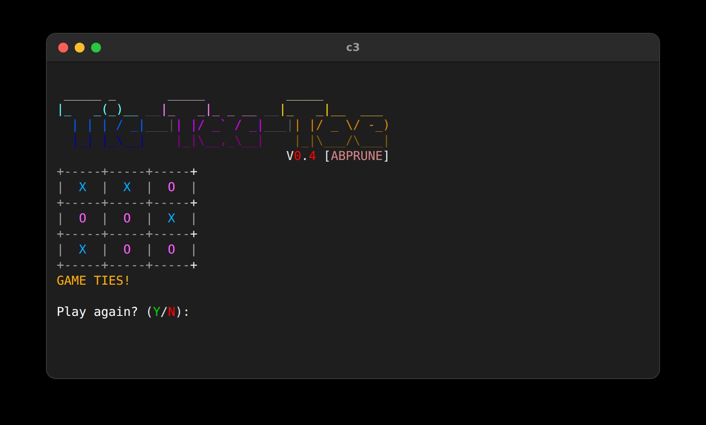

## Tic-Tac-Toe - AI
A simple Tic-Tac-Toe game between Human and Computer in the terminal. Simply an illustration of the MiniMax algorithm. It's just for fun during the pandemic.

## How to play
- Pick a difficulty level, then enter the number of a free cell (`0`-`8` on the default board) to place your piece.
- You play `O` and always move first; the computer plays `X`.
- Enter `-1` to give up the current game.

| Level      | Computer strategy           |
|------------|-----------------------------|
| Easy       | Plays a random free cell    |
| Medium     | MiniMax with search depth 3 |
| Hard       | MiniMax with search depth 5 |
| Impossible | MiniMax with search depth 6 |

## Engine
- MiniMax search with Alpha-Beta pruning. The pruning can be disabled by undefining the `_USE_ALPHA_BETA_PRUNE_` symbol in `defs.h`; the title screen shows which engine is in use (`ABPRUNE` or `MINIMAX`).
- A transposition table remembers positions that were already searched. With Alpha-Beta pruning, each entry records whether its score is exact or only a bound, so cached results never mislead the search.
- Moves are tried in order of how many winning lines pass through a cell (center, then corners, then edges on a 3x3 board), which lets the pruning skip more of the search.
- The board size can be changed via the symbol `BOARD_SIZE` in `defs.h`. The default value is `3`.

## Compiling
* GCC / Clang: type `make`
* MinGW: type `mingw32-make`
* DJGPP (DOS): type `makedos.bat`

## Tests
Tests are included in the `test` folder. To build and run them, type `make test`.
- `tst_eng`: board handling, win/tie detection, AI blocking and winning moves, and a check that plays every possible game against the Medium, Hard and Impossible levels to make sure the computer never loses.
- `tst_hlp`: screen and progress bar helpers.

## Tested
- Clang 21 (macOS Golden Gate)
- MinGW64 (Windows)
- GCC (Linux)

## Notes
- DOS support is now supported again.
- This is just a basic version of the game. Feels free to fork and modify anyway you need.

## Screenshots

